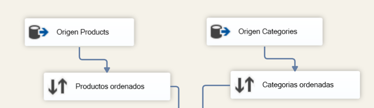
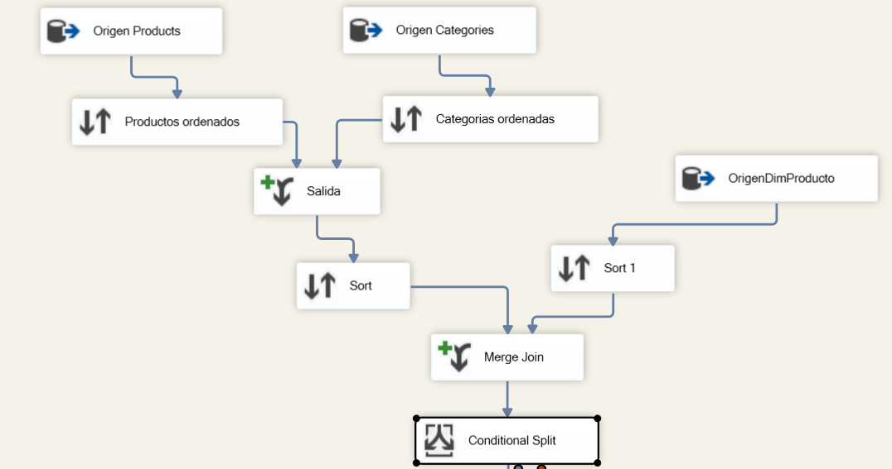
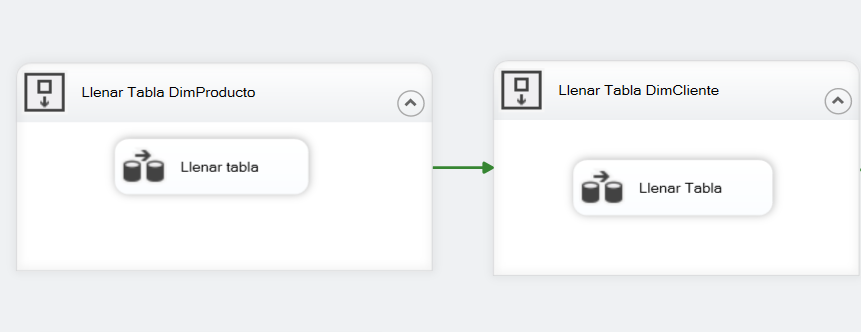
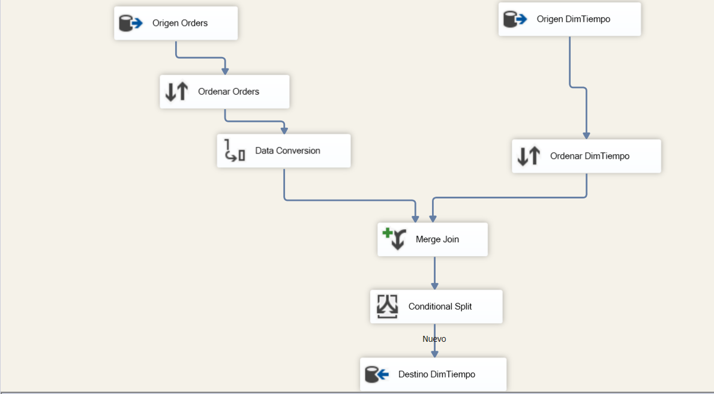
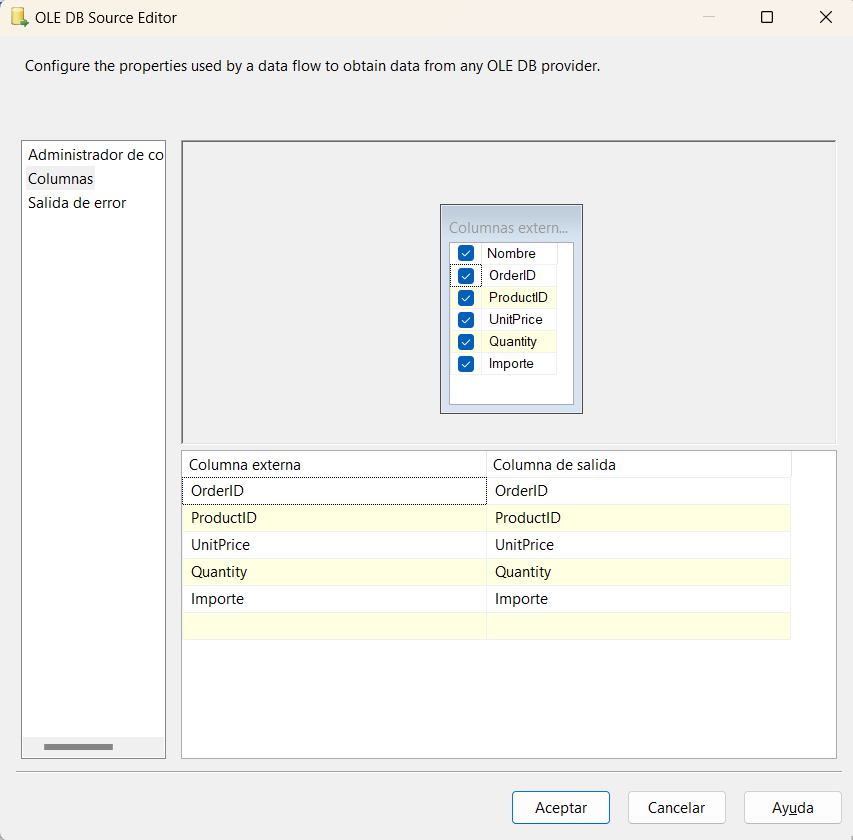
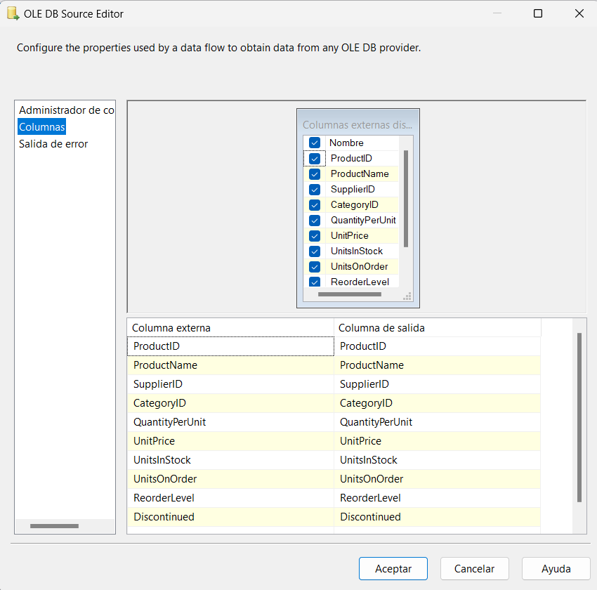
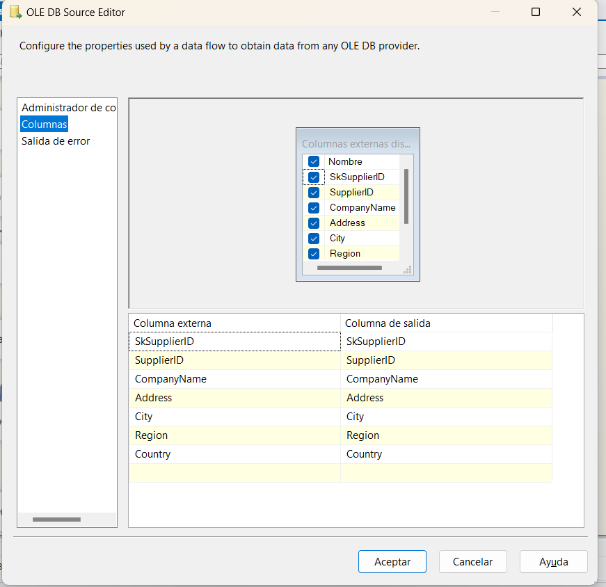
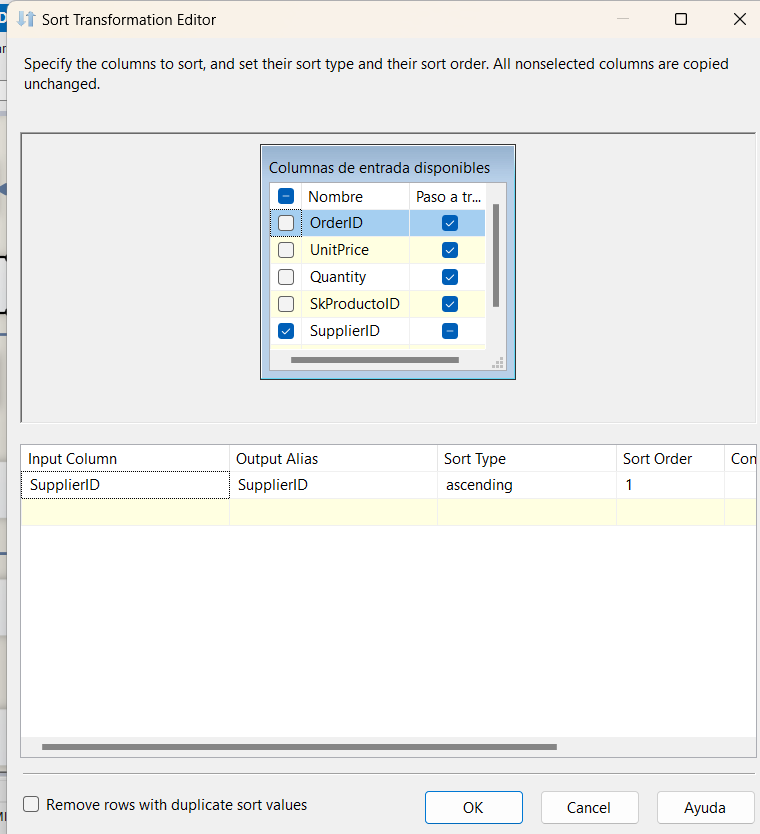
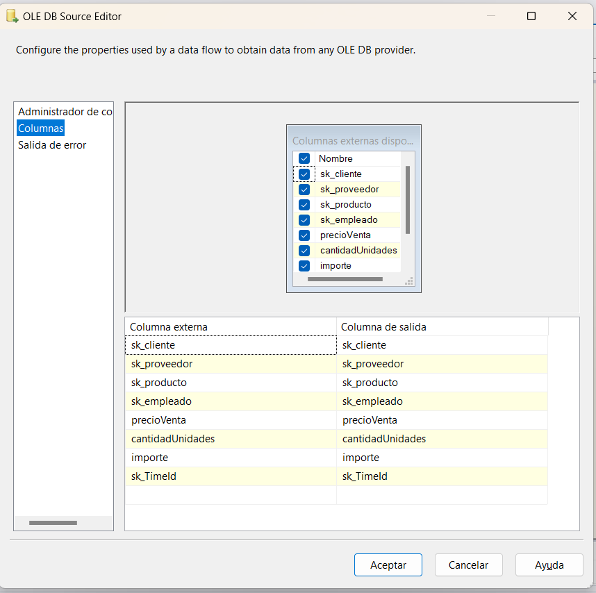

# Actividad de Evaluación. Practica de equipo con SSIS

### El primer paso fue crear nuestro nuevo proyecto en Visual Studio de tipo Integration Services Project y dentro crear un nuevo paquete SSIS. Y crear la base de datos de `DATAMARTVENTAS` con sus tablas correspondientes que posteriormente a lo largo de la practica vamos a llenar utilizando datos de la base de datos de `NORTHWND` Este es el script que utilizamos:

```SQL
create database DATAMARTVENTAS
-- GO
USE DATAMARTVENTAS

-- SELECT de las tablas para DATAMARTVENTAS
select * from DimProducto;
select * from DimCliente;
select * from DimProveedor;
select * from DimEmpleado;
select * from DimTiempo;
select * from factVentas;

-- DELETE de las tablas para DATAMARTVENTAS
delete from DimProducto;
delete from DimCliente;
delete from DimProveedor;
delete from DimEmpleado;
delete from DimTiempo;
delete from factVentas;

-- Creacion de las tablas
CREATE TABLE [dbo].DimProducto(
	SkProductoID int not null identity(1,1) primary key,
	[ProductID] [int] NOT NULL,
	[ProductName] [nvarchar](40) NOT NULL,
	CategoryName nvarchar(15) not null,
	[UnitsInStock] [smallint] NULL
)
	go

CREATE TABLE [dbo].[DimEmpleado](
	SkEmployeeId int not null identity(1,1) primary key,
	[EmployeeID] [int]  NOT NULL,
	FullName nvarchar(50) not null,
	[Address] [nvarchar](60) NULL,
	[City] [nvarchar](15) NULL,
	[Region] [nvarchar](15) NULL,
	[Country] [nvarchar](15) NULL
)
go

CREATE TABLE [dbo].[DimCliente](
	SkCustomerID int not null identity(1,1) primary key,
	[CustomerID] [nchar](5) NOT NULL,
	[CompanyName] [nvarchar](40) NOT NULL,
	[Address] [nvarchar](60) NULL,
	[City] [nvarchar](15) NULL,
	[Region] [nvarchar](15) NULL,
	[Country] [nvarchar](15) NULL
)
	go

CREATE TABLE [dbo].[DimProveedor](
	SkSupplierID int not null identity(1,1) primary key,
	[SupplierID] [int] NOT NULL,
	[CompanyName] [nvarchar](40) NOT NULL,
	[Address] [nvarchar](60) NULL,
	[City] [nvarchar](15) NULL,
	[Region] [nvarchar](15) NULL,
	[Country] [nvarchar](15) NULL
	)
	go

CREATE TABLE [dbo].[DimTiempo](
	SkTimeId int not null identity(1,1) primary key,
	TimeFecha date not null,
	TimeAnio int not null,
	TimeTrimestre int not null,
	TimeMes int not null,
	TimeDescripcionMes nvarchar(20) not null,
	TimeDescripcionTrimestre nvarchar(20) not null
	)
	go

create TABLE factVentas (
	sk_cliente int not null,
	sk_proveedor int not null,
	sk_producto int not null,
	sk_empleado int not null,
	sk_TimeId int not null,
	precioVenta money not null,
	cantidadUnidades int not null,
	importe money not null,
	constraint pk_fact_ventas
	primary key (sk_cliente, sk_proveedor, sk_producto, sk_empleado, sk_TimeId),
	constraint fk_fact_cliente
	foreign key (sk_cliente)
	references DimCliente,
	constraint fk_fact_proveedor
	foreign key (sk_proveedor)
	references DimProveedor,
	constraint fk_fact_producto
	foreign key (sk_producto)
	references DimProducto,
	constraint fk_fact_empleado
	foreign key (sk_empleado)
	references DimEmpleado,
	constraint fk_fact_DimTiempo
	foreign key (sk_TimeId)
	references DimTiempo,
)

insert into DATAMARTVENTAS.dbo.DimProducto
select p.productId, p.productName, c.CategoryName, p.unitsinstock
from NORTHWND.dbo.Products as p
inner join ( select categoryid, categoryname from NORTHWND.dbo.Categories) as c
on p.CategoryID = c.CategoryID

insert into DATAMARTVENTAS.dbo.DimCliente
select CustomerID, CompanyName, [Address], City, 
case
when Region is null then 'Sin Region' 
else Region
end as region
, Country
from NORTHWND.dbo.Customers

```

## Llenar tabla `DimProducto` 

`Utilizando los datos desde la base de datos de NORTHWND`

`Tablas utilizadas:`
- Products
- Categories 

Agregamos un contenedor de secuencias para tener orden en nuestro proyecto al querer transferir datos entre la fuente y los destinos, despues dentro agregamos un Data Flow Task o Tarea de Flujo de datos el cual nos va a permitir definir y ejecutar procesos de extracción, transformación y carga (ETL) de datos. 

Cuando agregamos un Data Flow Task al flujo de control del paquete SSIS en el que estamos trabajando, lo que hacemos es que estamos creando una sección donde podremos definir cómo los datos se mueven desde una fuente (Que en este caso, es la base de datos "NORTHWND") hacia un destino (la tabla DimProducto en la base de datos "DATAMARTVENTAS").


Una vez creado esto, damos doble clic a nuestro Data Flow Task que hara la tarea de llenar la tabla Dim Producto, 

Dentro agregamos 2 OLE DB Source ó Origenes de OLE DB para configurar dentro nuestras conexiones en este caso con la base de datos de NORTHWND por lo que en el administrador de conexiones tenemos que tener en Proveedor la opcion de Microsoft OLE DB Driver for SQL Server, despues el nombre del servidor que puedes verlo en sql server management studio al dar clic derecho e ir a properties. Y finalmente en Initial catalog eligiremos la base de datos que vamos a utilizar, en este caso elegimos NORTHWND. Esta conexión se utiliza para acceder a la tabla "Products" y recuperar los datos necesarios para nuestra carga de datos.

Conexion:


Primer OLE DB Source:

Este primer Origen OLE DB actuará como la primer fuente de datos en nuestro Data Flow Task. Se conecta a una fuente de datos OLE DB, que en este caso es la base de datos "NORTHWND". Y el OLE DB Source ejecutará la consulta SQL que hemos especificado y devolverá los resultados al flujo de datos para que puedan ser procesados y transferidos al destino. Como se observa en la imagen, elegimos el modo "Comando SQL" para especificar una consulta SQL personalizada que va a extraer los datos de la tabla "Products" de la base de datos NORTHWND. La consulta SQL selecciona las columnas ProductID, ProductName, UnitsInStock y CategoryID de la tabla "Products" que necesitaremos para cargar la tabla DimProducto en la base de datos "DATAMARTVENTAS". Una vez que se ejecuta esta consulta, los resultados se mapearán a las columnas correspondientes en la tabla de destino (DimProducto). Hay que asegurarnos de que las columnas devueltas por la consulta se correspondan adecuadamente con las columnas en la tabla de destino para evitar errores de mapeo, esto lo revisamos en la opcion donde dice Columnas.

Mappeo de los datos a la tabla de destino:


Lo mismo haremos para el `segundo` ORIGEN OLE DB, haremos conexion a la base de datos de NORTHWND y por medio de comando SQL agregaremos una consulta. Esta conexión se utiliza para acceder a la tabla "Categories" de NORTHWND y recuperar los datos necesarios. La consulta SQL que pusimos lo que hace es seleccionar las columnas CategoryID y CategoryName de la tabla "Categories". Y al igual que en el primer OLE DB Source, nos tenemos que asegurar de que las columnas devueltas por la consulta se correspondan adecuadamente con las columnas en la tabla de destino (DimProducto) para evitar errores de mapeo.

Segundo OLE DB Source:


Mappeo:


Luego conectamos 2 componentes Sort ó Ordenar que sirven para para ordenar los datos, de este modo nos aseguramos que estén organizados de manera consistente antes de continuar con otras operaciones, como por ejemplo fusionar conjuntos de datos de múltiples fuentes. En este caso, decidimos ordenar los datos extraídos de las tablas "Products" y "Categories" para asegurarnos de que estén alineados antes de fusionarlos.

En el primer Sort seleccionamos la columna CategoryID como la columna por la cual se van a ordenar los datos. Esto significa que los registros se ordenarán en función de los valores de la columna CategoryID y esto se hara en orden ascendente esto lo especificamos con el numero 1, esto significa que los valores más pequeños de CategoryID aparecerán primero, seguidos de los valores más grandes.


En el segundo Sort igual seleccionamos la columna CategoryID como la columna por la cual se van a ordenar los datos. Esto significa que los registros se ordenarán en función de los valores de la columna CategoryID como en el anterior caso y esto se hara en orden ascendente esto lo especificamos con el numero 1, esto significa que los valores más pequeños de CategoryID aparecerán primero, seguidos de los valores más grandes. 




Despues de ordenar nuestros datos de origen por el campo CategoryID lo que hicimos fue agregar un Merge Join ó combinacion de Mezcla. Este componente se utiliza para combinar dos flujos de datos en uno solo, basado en una o más columnas clave. El Merge Join es útil cuando necesitas combinar datos de dos fuentes diferentes en este caso "Products" y "Categories" en función de valores comunes en una columna, similar a la operación de unión en SQL.

Seleccionado un Inner Join, solo se incluirán los registros que tienen coincidencias en ambas tablas en función de la columna especificada como clave de combinación.
Es decir, solo se incluirán los registros donde haya una coincidencia entre CategoryID en la tabla "Productos Ordenados" y CategoryID en la tabla "Categorías Ordenadas".
Los registros que no tienen una coincidencia en ambas tablas se excluyen del resultado final. Esto significa que solo se incluirán los productos que tienen una categoría asociada y viceversa.

La columna CategoryID la seleccionamos como la clave de combinación que vamos a usar en ambas tablas. Tanto en las columnas de entrada (Input Column) como en las columnas de salida (Output Column), se puede visualizar en la imagen que seleccionamos los campos que necesitamos solamente, que son los que se van a incluir en el resultado final del Merge Join. Los campos seleccionados son ProductID, ProductName, UnitsInStock y CategoryName. Estos son los campos que se enviaran al siguiente paso del flujo de datos. Entonces lo que estamos haciendo es asegurandonos de que todos los productos y categorías, exceptuando aquellos que no tienen una correspondencia directa en la otra tabla, se incluyan en el resultado final.


Luego añado un tercer Origen OLE DB con conexion a mi tabla DimProducto con la finalidad de que se verifique si en una segunda ejecucion del ETL ya existen ciertos datos y no se vuelvan a insertar, sino que solo se inserten los nuevos datos que no esten registrados en la base de datos. 


Luego añadimos 2 componentes sort, uno para ordenar los datos del Inner join que hice entre la tabla Products y entre la tabla Categories, y el otro para ordenar los datos de la tabla DimProductos ambos por el campo ProductID

Sort para el Inner Join entre Products y Categories:


Sort para la tabla DimProducto:


Luego de ordenar los datos añadimos un nuevo componente Merge Join o Combinar Mezcla, para hacer nuevamente una union entre los datos que obtuvimos del Inner Join entre Products y Categories, y los datos que obtuvimos de la tabla DimProducto ya ordenados por ProductID.

En el merge Join para combinar los datos ahora combinamos los datos del Inner Join entre las tablas "Products" y "Categories" con los datos ordenados de la tabla DimProducto.
Utilizar un Merge Join te permite fusionar los datos de manera eficiente utilizando el campo ProductID como clave de combinación. Dentro del Merge Join hicimos un Left Outer Join. Esto significa que se incluirán todos los registros de la tabla DimProducto (lado izquierdo), incluso si no tienen coincidencias en la combinación con los datos del Inner Join (lado derecho), de esta manera todos los productos de la tabla DimProducto estarán incluidos en el resultado final, incluso si no tienen correspondencia directa en los datos del Inner Join. En ambos lados del Merge Join, estamos utilizando el campo ProductID como la clave de combinación. Asi aseguramos que los registros se combinen correctamente en función del ID del producto, de esta manera, estamos fusionando efectivamente los datos del Inner Join con los datos ordenados de la tabla DimProducto en función del ProductID.

Luego añadimos un nuevo componente llamado division condicional, y lo conectamos al resultado del Left Outer Join que hicimos, luego de conectarlo lo que hacemos es aplicar una lógica de división para filtrar los registros según una condición dada.




Pusimos la condicion en Condition:

```
ISNULL([ProductID (1)])
```
Lo que hacemos con esta condición es verificar si el campo ProductID es nulo en el flujo de datos resultante del Left Outer Join. Si el ProductID es nulo, los registros que cumplan esta condición se dirigirán al flujo de datos identificado como "nuevo". Al aplicar esta división condicional, filtramos los registros en función de si tienen un ProductID nulo o no es decir con la condicion sabremos si son registros nuevos o no los que vienen de los origenes.

Finalmente coloque un OLE DB Destination con conexion a la tabla DimProducto de la base de datos DATAMARTVENTAS. Este componente se utiliza para cargar los datos que traemos desde los origenes, en una tabla específica de una base de datos utilizando una conexión OLE DB, en este caso a la tabla DimProducto, insertaremos los registros combinados con los join en la tabla final de la base de datos "DATAMARTVENTAS".

Al ejecutar podremos observar que ya se insertaron datos en nuestra tabla DimProducto


## Llenar tabla `DimCliente` 

`Utilizando los datos desde la base de datos de NORTHWND`

`Tablas utilizadas:`
- Customers

Agregamos otro contenedor de secuencias para tener orden en nuestro proyecto al querer transferir datos entre la fuente y los destinos y no conectamos al anterior contenedor de secuencias, despues dentro agregamos un Data Flow Task o Tarea de Flujo de datos el cual nos va a permitir definir y ejecutar procesos de extracción, transformación y carga (ETL) de datos. 



Cuando agregamos un Data Flow Task al flujo de control del paquete SSIS en el que estamos trabajando, lo que hacemos es que estamos creando una sección donde podremos definir cómo los datos se mueven desde una fuente (Que en este caso, es la base de datos "NORTHWND") hacia un destino (la tabla DimCliente en la base de datos "DATAMARTVENTAS").

Una vez creado esto, damos doble clic a nuestro Data Flow Task que hara la tarea de llenar la tabla Dim Cliente, 

Dentro agregamos 2 OLE DB Source ó Origenes de OLE DB para configurar dentro nuestras conexiones en este caso con la base de datos de NORTHWND por lo que en el administrador de conexiones tenemos que tener en Proveedor la opcion de Microsoft OLE DB Driver for SQL Server, despues el nombre del servidor que puedes verlo en sql server management studio al dar clic derecho e ir a properties. Y finalmente en Initial catalog eligiremos la base de datos que vamos a utilizar, en este caso elegimos NORTHWND. Esta conexión se utiliza para acceder a la tabla "Customers" y recuperar los datos necesarios para nuestra carga de datos.

Primer OLE DB Source:


Mappeo de los campos en el primer OLE DB Source:


Este primer Origen OLE DB actuará como la primer fuente de datos en nuestro Data Flow Task. Se conecta a una fuente de datos OLE DB, que en este caso es la base de datos "NORTHWND". Y el OLE DB Source ejecutará la consulta SQL que hemos especificado y devolverá los resultados al flujo de datos para que puedan ser procesados y transferidos al destino. Como se observa en la imagen, elegimos el modo "Comando SQL" para especificar una consulta SQL personalizada que va a extraer los datos de la tabla "Customers" de la base de datos NORTHWND. La consulta SQL que has especificado selecciona varias columnas de la tabla "Customers", incluyendo CustomerID, CompanyName, Address, City, Region, y Country. La parte case en la consulta se utiliza para manejar el caso en el que el valor de Region sea nulo. Si es nulo, devuelve 'Sin Region', de lo contrario, devuelve el valor de Region normalmente de la tabla "Customers" que necesitaremos para cargar la tabla DimCliente en la base de datos "DATAMARTVENTAS". Una vez que se ejecuta esta consulta, los resultados se mapearán a las columnas correspondientes en la tabla de destino (DimCliente). Hay que asegurarnos de que las columnas devueltas por la consulta se correspondan adecuadamente con las columnas en la tabla de destino para evitar errores de mapeo, esto lo revisamos en la opcion donde dice Columnas.

Segundo OLE DB Source:


Mappeo de los campos en el segundo OLE DB Source:


Luego Añadimos 2 elementos sort para ordenar los datos que traemos del origen tanto de la tabla Customers de la base de datos NORTHWND como de la tabla DimCliente. Vamos a ordenar ambos por el campo CustomerID.

Primer Sort:


Segundo Sort:


Una vez que ambos estan ordenados añadimos un merge join para hacer la mezcla de los datos, y poder hacer un left outer join
en la imagen se muestra como hemos configurado el componente Merge Join en nuestro flujo de datos, utilizando un Left Outer Join para combinar los registros de nuestras dos fuentes de datos basadas en una clave común, que en este caso es CustomerID, como todo se hace por CustomerID para ambas fuentes, lo que hara SSIS es buscar coincidencias basadas en esta columna, seleccionamos los campos CustomerID, CompanyName, Address, City, Region, Country desde el flujo izquierdo y CustomerID del flujo derecho.

Merge join de tipo Left Outer Join:


Configuracion del Merge join:


Luego añadimos un nuevo componente llamado division condicional, y lo conectamos al resultado del Left Outer Join que hicimos, luego de conectarlo lo que hacemos es aplicar una lógica de división para filtrar los registros según una condición dada.


Pusimos la condicion en Condition:

```
ISNULL(DimCustomerID)
```
Lo que hacemos con esta condición es verificar si el campo ProductID es nulo en el flujo de datos resultante del Left Outer Join. Si el ProductID es nulo, los registros que cumplan esta condición se dirigirán al flujo de datos identificado como "Case 1". Al aplicar esta división condicional, filtramos los registros en función de si tienen un CustomerID nulo o no es decir con la condicion sabremos si son registros nuevos o no los que vienen de los origenes.


Finalmente coloque un OLE DB Destination con conexion a la tabla DimCliente de la base de datos DATAMARTVENTAS. Este componente se utiliza para cargar los datos que traemos desde los origenes, en una tabla específica de una base de datos utilizando una conexión OLE DB, en este caso a la tabla DimCliente, insertaremos los registros combinados con los join en la tabla final de la base de datos "DATAMARTVENTAS".

Al ejecutar podremos observar que ya se insertaron datos en nuestra tabla DimCliente y de DimProducto siguen exactamente igual ya que nuestro ETL no detecto campos nuevos o nulos en el filtro al hacer la ejecucion.


## Llenar tabla `DimProveedor` 

`Utilizando los datos desde la base de datos de NORTHWND`

`Tablas utilizadas:`
- Suppliers

Agregamos otro contenedor de secuencias para tener orden en nuestro proyecto al querer transferir datos entre la fuente y los destinos y no conectamos al anterior contenedor de secuencias, despues dentro agregamos un Data Flow Task o Tarea de Flujo de datos el cual nos va a permitir definir y ejecutar procesos de extracción, transformación y carga (ETL) de datos. 


Cuando agregamos un Data Flow Task al flujo de control del paquete SSIS en el que estamos trabajando, lo que hacemos es que estamos creando una sección donde podremos definir cómo los datos se mueven desde una fuente (Que en este caso, es la base de datos "NORTHWND") hacia un destino (la tabla DimProveedor en la base de datos "DATAMARTVENTAS").

Una vez creado esto, damos doble clic a nuestro Data Flow Task que hara la tarea de llenar la tabla DimProveedor, 

Dentro agregamos 2 OLE DB Source ó Origenes de OLE DB para configurar dentro nuestras conexiones en este caso con la base de datos de NORTHWND por lo que en el administrador de conexiones tenemos que tener en Proveedor la opcion de Microsoft OLE DB Driver for SQL Server, despues el nombre del servidor que puedes verlo en sql server management studio al dar clic derecho e ir a properties. Y finalmente en Initial catalog eligiremos la base de datos que vamos a utilizar, en este caso elegimos NORTHWND. Esta conexión se utiliza para acceder a la tabla "Suppliers" y recuperar los datos necesarios para nuestra carga de datos.

Primer OLE DB Source:


Mappeo de los campos en el primer OLE DB Source:


Este primer Origen OLE DB actuará como la primer fuente de datos en nuestro Data Flow Task. Se conecta a una fuente de datos OLE DB, que en este caso es la base de datos "NORTHWND". Y el OLE DB Source ejecutará la consulta SQL que hemos especificado y devolverá los resultados al flujo de datos para que puedan ser procesados y transferidos al destino. Como se observa en la imagen, elegimos el modo "Comando SQL" para especificar una consulta SQL personalizada que va a extraer los datos de la tabla "Suppliers" de la base de datos NORTHWND. 

La consulta SQL que colocamos selecciona varias columnas de la tabla "Suppliers", incluyendo CompanyName, Address, City, Region y Country. La parte case en la consulta se utiliza para manejar el caso en el que el valor de Region sea nulo. Si es nulo, devuelve 'Sin Region', de lo contrario, devuelve el valor de Region normalmente de la tabla "Suppliers" que necesitaremos para cargar la tabla DimProveedor en la base de datos "DATAMARTVENTAS". Una vez que se ejecuta esta consulta, los resultados se mapearán a las columnas correspondientes en la tabla de destino (DimProveedor). Hay que asegurarnos de que las columnas devueltas por la consulta se correspondan adecuadamente con las columnas en la tabla de destino para evitar errores de mapeo, esto lo revisamos en la opcion donde dice Columnas.

Segundo OLE DB Source:


Mappeo de los campos en el segundo OLE DB Source:


Luego Añadimos 2 elementos sort para ordenar los datos que traemos del origen tanto de la tabla Suppliers de la base de datos NORTHWND como de la tabla DimProveedor. Vamos a ordenar ambos por el campo SupplierID.

Primer Sort:


Segundo Sort:


Una vez que ambos estan ordenados añadimos un merge join para hacer la mezcla de los datos, y poder hacer un left outer join
en la imagen se muestra como hemos configurado el componente Merge Join en nuestro flujo de datos, utilizando un Left Outer Join para combinar los registros de nuestras dos fuentes de datos basadas en una clave común, que en este caso es SupplierID, como todo se hace por SupplierID para ambas fuentes, lo que hara SSIS es buscar coincidencias basadas en esta columna, seleccionamos los campos SupplierID, CompanyName, Address, City, Region, Country desde el flujo izquierdo y SupplierID del flujo derecho.

Merge join de tipo Left Outer Join:


Configuracion del Merge join:


Luego añadimos un nuevo componente llamado division condicional, y lo conectamos al resultado del Left Outer Join que hicimos, luego de conectarlo lo que hacemos es aplicar una lógica de división para filtrar los registros según una condición dada.


Pusimos la condicion en Condition:

```
ISNULL([SupplierID (1)])
```
Lo que hacemos con esta condición es verificar si el campo SupplierID es nulo en el flujo de datos resultante del Left Outer Join. Si el SupplierID es nulo, los registros que cumplan esta condición se dirigirán al flujo de datos identificado como "Case 1". Al aplicar esta división condicional, filtramos los registros en función de si tienen un SupplierID nulo o no es decir con la condicion sabremos si son registros nuevos o no los que vienen de los origenes.


Finalmente coloque un OLE DB Destination con conexion a la tabla DimProveedor de la base de datos DATAMARTVENTAS. Este componente se utiliza para cargar los datos que traemos desde los origenes, en una tabla específica de una base de datos utilizando una conexión OLE DB, en este caso a la tabla DimProveedor, insertaremos los registros combinados con los join en la tabla final de la base de datos "DATAMARTVENTAS".

Al ejecutar podremos observar que ya se insertaron datos en nuestra tabla DimProveedor.


## Llenar tabla `DimEmpleado` 

`Utilizando los datos desde la base de datos de NORTHWND`

`Tablas utilizadas:`
- Employees

Agregamos otro contenedor de secuencias para tener orden en nuestro proyecto al querer transferir datos entre la fuente y los destinos y no conectamos al anterior contenedor de secuencias, despues dentro agregamos un Data Flow Task o Tarea de Flujo de datos el cual nos va a permitir definir y ejecutar procesos de extracción, transformación y carga (ETL) de datos. 


Cuando agregamos un Data Flow Task al flujo de control del paquete SSIS en el que estamos trabajando, lo que hacemos es que estamos creando una sección donde podremos definir cómo los datos se mueven desde una fuente (Que en este caso, es la base de datos "NORTHWND") hacia un destino (la tabla DimEmpleado en la base de datos "DATAMARTVENTAS").

Una vez creado esto, damos doble clic a nuestro Data Flow Task que hara la tarea de llenar la tabla DimEmpleado, 

Dentro agregamos 2 OLE DB Source ó Origenes de OLE DB para configurar dentro nuestras conexiones en este caso con la base de datos de NORTHWND por lo que en el administrador de conexiones tenemos que tener en Empleado la opcion de Microsoft OLE DB Driver for SQL Server, despues el nombre del servidor que puedes verlo en sql server management studio al dar clic derecho e ir a properties. Y finalmente en Initial catalog eligiremos la base de datos que vamos a utilizar, en este caso elegimos NORTHWND. Esta conexión se utiliza para acceder a la tabla "Employees" y recuperar los datos necesarios para nuestra carga de datos.

Primer OLE DB Source:


Mappeo de los campos en el primer OLE DB Source:


Este primer Origen OLE DB actuará como la primer fuente de datos en nuestro Data Flow Task. Se conecta a una fuente de datos OLE DB, que en este caso es la base de datos "NORTHWND". Y el OLE DB Source ejecutará la consulta SQL que hemos especificado y devolverá los resultados al flujo de datos para que puedan ser procesados y transferidos al destino. Como se observa en la imagen, elegimos el modo "Comando SQL" para especificar una consulta SQL personalizada que va a extraer los datos de la tabla "Suppliers" de la base de datos NORTHWND. 

La consulta SQL que colocamos selecciona varias columnas de la tabla "Employees", incluyendo EmployeeID, FirstName, LastName, Address, City, Region y Country. La parte case en la consulta se utiliza para manejar el caso en el que el valor de Region sea nulo. Si es nulo, devuelve 'Sin Region', de lo contrario, devuelve el valor de Region normalmente de la tabla "Employees" que necesitaremos para cargar la tabla DimEmpleado en la base de datos "DATAMARTVENTAS". Una vez que se ejecuta esta consulta, los resultados se mapearán a las columnas correspondientes en la tabla de destino (DimEmpleado). Hay que asegurarnos de que las columnas devueltas por la consulta se correspondan adecuadamente con las columnas en la tabla de destino para evitar errores de mapeo, esto lo revisamos en la opcion donde dice Columnas.

Segundo OLE DB Source:


Mappeo de los campos en el segundo OLE DB Source:


Luego añadimos una columna derivada y la pusimos en el primer OLE DB Source que tenemos que hace conexion con la tabla Employees de NORTHWND, a la nueva columna le colocamos el nombre FullName, luego en Derived Column le colocamos <add as new column> Lo cual indica que estamos creando una nueva columna (FullName) en lugar de reemplazar una existente, en la expresion concatenamos los valores de las columnas FirstName y LastName con un espacio en blanco entre ellos para formar el nombre completo.

Columna derivada:


Luego Añadimos 2 elementos sort para ordenar los datos que traemos del origen tanto de la tabla Employees del cual generamos el nombre completo de la base de datos NORTHWND como de la tabla DimEmpleado. Vamos a ordenar ambos por el campo EmployeeID.

Imagen de estructura:


Primer Sort:


Segundo Sort:


Una vez que ambos estan ordenados añadimos un merge join para hacer la mezcla de los datos, y poder hacer un left outer join
en la imagen se muestra como hemos configurado el componente Merge Join en nuestro flujo de datos, utilizando un Left Outer Join para combinar los registros de nuestras dos fuentes de datos basadas en una clave común, que en este caso es EmployeeID, como todo se hace por EmployeeID para ambas fuentes, lo que hara SSIS es buscar coincidencias basadas en esta columna, seleccionamos los campos EmployeeID, FirstName, LastName, Address, City, Region, Country, FullName (la nueva columna que creamos anteriormente) desde el flujo izquierdo y EmployeeID del flujo derecho.

Merge join de tipo Left Outer Join:


Configuracion del Merge join:


Luego añadimos un nuevo componente llamado division condicional, y lo conectamos al resultado del Left Outer Join que hicimos, luego de conectarlo lo que hacemos es aplicar una lógica de división para filtrar los registros según una condición dada.


Pusimos la condicion en Condition:

```
ISNULL([EmployeeID (1)])
```
Lo que hacemos con esta condición es verificar si el campo EmployeeID es nulo en el flujo de datos resultante del Left Outer Join. Si el EmployeeID es nulo, los registros que cumplan esta condición se dirigirán al flujo de datos identificado como "Case 1". Al aplicar esta división condicional, filtramos los registros en función de si tienen un EmployeeID nulo o no es decir con la condicion sabremos si son registros nuevos o no los que vienen de los origenes.


Finalmente coloque un OLE DB Destination con conexion a la tabla DimEmpleado de la base de datos DATAMARTVENTAS. Este componente se utiliza para cargar los datos que traemos desde los origenes, en una tabla específica de una base de datos utilizando una conexión OLE DB, en este caso a la tabla DimEmpleado, insertaremos los registros combinados con los join en la tabla final de la base de datos "DATAMARTVENTAS".

Al ejecutar podremos observar que ya se insertaron datos en nuestra tabla DimEmpleado.


## Llenar tabla `DimTiempo` 

`Utilizando los datos desde la base de datos de NORTHWND`

`Tablas utilizadas:`
- Orders

Agregamos otro contenedor de secuencias para tener orden en nuestro proyecto al querer transferir datos entre la fuente y los destinos y no conectamos al anterior contenedor de secuencias, despues dentro agregamos un Data Flow Task o Tarea de Flujo de datos el cual nos va a permitir definir y ejecutar procesos de extracción, transformación y carga (ETL) de datos. 


Cuando agregamos un Data Flow Task al flujo de control del paquete SSIS en el que estamos trabajando, lo que hacemos es que estamos creando una sección donde podremos definir cómo los datos se mueven desde una fuente (Que en este caso, es la base de datos "NORTHWND") hacia un destino (la tabla DimTiempo en la base de datos "DATAMARTVENTAS").

Una vez creado esto, damos doble clic a nuestro Data Flow Task que hara la tarea de llenar la tabla DimTiempo.

Dentro agregamos 2 OLE DB Source ó Origenes de OLE DB para configurar dentro nuestras conexiones en este caso con la base de datos de NORTHWND por lo que en el administrador de conexiones tenemos que tener la opcion de Microsoft OLE DB Driver for SQL Server, despues el nombre del servidor que puedes verlo en sql server management studio al dar clic derecho e ir a properties. Y finalmente en Initial catalog eligiremos la base de datos que vamos a utilizar, en este caso elegimos NORTHWND. Esta conexión se utiliza para acceder a la tabla "Orders" y recuperar los datos necesarios para nuestra carga de datos.

Primer OLE DB Source:


Mappeo de los campos en el primer OLE DB Source:


Este primer Origen OLE DB actuará como la primer fuente de datos en nuestro Data Flow Task. Se conecta a una fuente de datos OLE DB, que en este caso es la base de datos "NORTHWND". Y el OLE DB Source ejecutará la consulta SQL que hemos especificado y devolverá los resultados al flujo de datos para que puedan ser procesados y transferidos al destino. Como se observa en la imagen, elegimos el modo "Comando SQL" para especificar una consulta SQL personalizada que va a extraer los datos de la tabla "Orders" de la base de datos NORTHWND. 

CONVERT(date, OrderDate) as TimeFecha
Primero con esta parte de la consulta convertimos la columna OrderDate en un tipo de datos date utilizando la función CONVERT() y le damos el alias `TimeFecha`, luego con la función YEAR() para extraer el año de la columna OrderDate y asigna el alias `TimeAnio` a esta columna. y con DATEPART(QUARTER, OrderDate) as TimeTrimestre: Estamos usando la función DATEPART() para extraer el trimestre de la columna OrderDate y asigna el alias `TimeTrimestre` a esta columna.Luego con DATEPART(MONTH, OrderDate) as TimeMes: Utilizamos la función DATEPART() para extraer el mes de la columna OrderDate y asigna el alias `TimeMes` a esta columna. Luego con DATENAME(MONTH, OrderDate) AS TimeDescripcionMes,usando la función DATENAME() para obtener el nombre del mes en formato de texto de la columna OrderDate. Asigna el alias `TimeDescripcionMes` a esta columna. Finalmente con 
CASE...END AS TimeDescripcionTrimestre: Usamos una expresión CASE para determinar el trimestre en función de la fecha en la columna OrderDate. Luego, asigna el alias `TimeDescripcionTrimestre` a esta columna.

La consulta SQL que colocamos lo que hace es seleccionae varias columnas de la tabla "Orders" para generar campos calculados que estan compuestos. Una vez que se ejecuta esta consulta, los resultados se mapearán a las columnas correspondientes en la tabla de destino (DimTiempo). Hay que asegurarnos de que las columnas devueltas por la consulta se correspondan adecuadamente con las columnas en la tabla de destino para evitar errores de mapeo, esto lo revisamos en la opcion donde dice Columnas.

Segundo OLE DB Source:


Mappeo de los campos en el segundo OLE DB Source:


Luego Añadimos 2 elementos sort para ordenar los datos que traemos del origen tanto de la tabla Orders de la base de datos NORTHWND como de la tabla DimTiempo. Vamos a ordenar ambos por el campo TimeFecha.

Imagen de estructura:


Primer Sort:


Segundo Sort:


Luego añadimos el componente Data Conversion y lo conectamos al primer sort que ordena los datos que vienen de la tabla Orders de NORTHWND, en donde lo que hacemos es crear copias de los campos TimeDescripcionTrimestre y TimeDescripcionMes pero con el tipo de dato llamado cadena Unicode [DT_SWTR] y ambos con longitud de 20, esto para convertir los datos de estos 2 campos y posteriormente sea correcta la insercion de los datos a nuestra tabla DimTiempo:

Estructura:


Data conversion:


Una vez que ambos estan ordenados y que ya conversimos los datos con el Data conversion, añadimos un merge join para hacer la mezcla de los datos, y poder hacer un left outer join
en la imagen se muestra como hemos configurado el componente Merge Join en nuestro flujo de datos, utilizando un Left Outer Join para combinar los registros de nuestras dos fuentes de datos basadas en una clave común, que en este caso es TimeFecha, como todo se hace por TimeFecha para ambas fuentes, lo que hara SSIS es buscar coincidencias basadas en esta columna, seleccionamos los campos TimeFecha, TimeAnio, TimeTrimestre, TimeMes, TimeDescripcionMes, TimeDescripcionTrimestre, y las copias que hicimos de las descripciones ya que las copias son las que estan convertidas en su tipo de dato Copy of TimeDescripcionTrimestre, y Copy of TimeDescripcionMes todos estos datos desde el flujo izquierdo y el campo TimeFecha del flujo derecho.

Merge join de tipo Left Outer Join:


Configuracion del Merge join:


Luego añadimos un nuevo componente llamado division condicional, y lo conectamos al resultado del Left Outer Join que hicimos, luego de conectarlo lo que hacemos es aplicar una lógica de división para filtrar los registros según una condición dada.


Pusimos la condicion en Condition:

```
ISNULL([TimeFecha (1)])
```
Lo que hacemos con esta condición es verificar si el campo TimeFecha es nulo en el flujo de datos resultante del Left Outer Join. Si el TimeFecha es nulo, los registros que cumplan esta condición se dirigirán al flujo de datos identificado como "Nuevo". Al aplicar esta división condicional, filtramos los registros en función de si tienen un TimeFecha nulo o no es decir con la condicion sabremos si son registros nuevos o no los que vienen de los origenes.



Finalmente colocamos un OLE DB Destination con conexion a la tabla DimTiempo de la base de datos DATAMARTVENTAS. Este componente se utiliza para cargar los datos que traemos desde los origenes, en una tabla específica de una base de datos utilizando una conexión OLE DB, en este caso a la tabla DimTiempo, insertaremos los registros combinados con los join en la tabla final de la base de datos "DATAMARTVENTAS".

Al ejecutar podremos observar que ya se insertaron datos en nuestra tabla DimTiempo.


## Llenar tabla `factVentas` 

Agregamos otro contenedor de secuencias para tener orden en nuestro proyecto al querer transferir datos entre la fuente y los destinos y no conectamos al anterior contenedor de secuencias, despues dentro agregamos un Data Flow Task o Tarea de Flujo de datos el cual nos va a permitir definir y ejecutar procesos de extracción, transformación y carga (ETL) de datos. 


Cuando agregamos un Data Flow Task al flujo de control del paquete SSIS en el que estamos trabajando, lo que hacemos es que estamos creando una sección donde podremos definir cómo los datos se mueven desde una fuente (Que en este caso, es la base de datos "NORTHWND") hacia un destino (la tabla factVentas en la base de datos "DATAMARTVENTAS").

Una vez creado esto, damos doble clic a nuestro Data Flow Task que hara la tarea de llenar la tabla factVentas.

Dentro agregamos 2 OLE DB Source ó Origenes de OLE DB para configurar dentro nuestras conexiones en este caso con la base de datos de NORTHWND por lo que en el administrador de conexiones tenemos que tener la opcion de Microsoft OLE DB Driver for SQL Server, despues el nombre del servidor que puedes verlo en sql server management studio al dar clic derecho e ir a properties. Y finalmente en Initial catalog eligiremos la base de datos que vamos a utilizar, en este caso elegimos NORTHWND. Esta conexión se utiliza para acceder a la tabla "Order Details" y recuperar los datos necesarios para nuestra carga de datos.

Primer OLE DB Source:


Mappeo de los campos en el primer OLE DB Source:


Este primer Origen OLE DB actuará como la primer fuente de datos en nuestro Data Flow Task. Se conecta a una fuente de datos OLE DB, que en este caso es la base de datos "NORTHWND". Y el OLE DB Source ejecutará la consulta SQL que hemos especificado y devolverá los resultados al flujo de datos para que puedan ser procesados y transferidos al destino. Como se observa en la imagen, elegimos el modo "Comando SQL" para especificar una consulta SQL personalizada que va a extraer los datos de la tabla "Order Details" de la base de datos NORTHWND. 

La consulta SQL que colocamos selecciona varias columnas de la tabla "Order Details", incluyendo UnitPrice, Quantity, Importe que es un campo calculado de UnitPrice multiplicado por OrderID, y ProductID. Una vez que se ejecuta esta consulta, los resultados se mapearán a las columnas correspondientes en la tabla de destino (factVentas). Hay que asegurarnos de que las columnas devueltas por la consulta se correspondan adecuadamente con las columnas en la tabla de destino para evitar errores de mapeo, esto lo revisamos en la opcion donde dice Columnas.

Segundo OLE DB Source:


Mappeo de los campos en el segundo OLE DB Source:


Luego Añadimos 2 elementos sort para ordenar los datos que traemos del origen tanto de la tabla Order Details de la base de datos NORTHWND como de la tabla factVentas. Vamos a ordenar ambos por el campo ProductID.

Imagen de estructura:


Primer Sort:


Segundo Sort:


Una vez que ambos estan ordenados y que ya conversimos los datos con el Data conversion, añadimos un merge join para hacer la mezcla de los datos, y poder hacer un inner join
en la imagen se muestra como hemos configurado el componente Merge Join en nuestro flujo de datos, utilizando un Inner Join para combinar los registros de nuestras dos fuentes de datos basadas en una clave común, que en este caso es ProductID, como todo se hace por TimeFecha para ambas fuentes, lo que hara SSIS es buscar coincidencias basadas en esta columna, seleccionamos los campos OrderID, UnitPrice, Quantity, y el importe todos estos datos desde el flujo izquierdo y los campos SKProductoID, y ProductID del flujo derecho.

Merge join de tipo Inner Join:


Configuracion del Merge join:


Luego añadimos un nuevo componente Origen de OLE DB que va a tener conexion con la tabla Products de NORTHWND

Origen OLE DB que acabamos de añadir


Mapping:


Luego agregamos 2 sort para ordenar tanto el Inner Join que hicimos como los datos que vienen de la tabla Products y ordenaremos en ambos por el campo ProductID.

Primer Sort:


Segundo Sort para ordenar datos de Products:


Luego ya que tenemos esos datos ordenados los vamos a mezclar con un Merge Join de tipo Inner Join por medio del ProductID, uniendo los campos OrderID, UnitPrice, Quantity, SkProductoID,SupplierID, Importe.

Estructura:


Configuracion del MergeJoin:


Luego añadimos un nuevo componente Origen de OLE DB que va a tener conexion con la tabla DimProveedor de DATAMARTVENTAS

Origen OLE DB que acabamos de añadir de DimProveedor


Mapping:


Luego agregamos 2 sort para ordenar tanto el Inner Join que hicimos como los datos que vienen de la tabla DimProveedor y ordenaremos en ambos por el campo SupplierID.

Primer Sort:


Segundo Sort para ordenar datos de DimProveedor:


Luego ya que tenemos esos datos ordenados los vamos a mezclar con un Merge Join de tipo Inner Join por medio del SupplierID, uniendo los campos OrderID, UnitPrice, Quantity, SkProductoID, y el Importe del lado del flujo izquierdo y SkSupplierID del flujo derecho.

Estructura:


Configuracion del MergeJoin:


De la misma forma repetiremos el proceso mas veces, añadimos origen de OLE DB, ordenamos y hacemos Merge Join y asi consecutivamente como lo hemos hecho, el siguiente tiene conexion con Orders y con la consulta SQL seleccionamos OrderID, EmployeeID, CustomerID, y OrderDate que es un campo calculado en donde concatenamos la fecha y la hora dentro de ese campo.

Origen OLE DB que acabamos de añadir de Orders


Mapping:


Luego Añadimos los componentes Sort y ordenamos ambos por OrderID.

Primer sort:


Segundo sort:


Luego ya que tenemos esos datos ordenados los vamos a mezclar con un Merge Join de tipo Inner Join por medio del OrderID, uniendo los campos UnitPrice, Quantity, SkProductoID, SkSupplierID y el Importe del lado del flujo izquierdo y los campos CustomerID, EmployeeID, y OrderDate del flujo derecho.

Estructura:


Configuracion del MergeJoin:


Hacemos lo mismo añadimos un origen OLE DB con la tabla DimEmpleado de DATAMARTVENTAS y ordenamos ambos usando Sort por medio del campo EmployeeID y para finalizar el Inner Join por medio de SkEmployeeID.

Origen de OLE DB:


Mapping:


Primer sort:


Segundo sort:


Estructura:


Configuracion del MergeJoin:


Hacemos lo mismo añadimos un origen OLE DB con la tabla DimCliente de DATAMARTVENTAS y ordenamos ambos usando Sort por medio del campo CustomerID y para finalizar el Inner Join por medio de SkCustomerID.

Origen de OLE DB:


Mapping:


Primer sort:


Segundo sort:


Estructura:


Configuracion del MergeJoin:


Hacemos lo mismo añadimos un origen OLE DB con la tabla DimTiempo por medio de codigo SQL de DATAMARTVENTAS seleccionando solo los campos SkTimeID, y TimeFecha. Luego ordenamos ambos usando Sort por medio del campo OrderDate y TimeFecha y para finalizar el Inner Join por medio de  OrderDate y TimeFecha.

Origen de OLE DB:


Mapping:


Primer sort:


Segundo sort:


Estructura:


Configuracion del MergeJoin:


Por ultimo hacemos lo mismo añadimos un origen OLE DB con la tabla factVentas de la base de datos DATAMARTVENTAS. Luego ordenamos ambos usando Sort por medio del campo SkProductoID y sk_producto, y para finalizar el Inner Join por medio de  SkProductoID y SkTimeID.

Origen de OLE DB:


Mapping:


Primer sort:


Segundo sort:


Estructura:


Configuracion del MergeJoin:


Luego para terminar añadimos un conditional split y lo conectamos al Merge Join que acabamos de hacer, y dentro colocamos el filtro para saber si hay nuevos registros el cual es:

```
ISNULL(sk_producto) || ISNULL(sk_cliente) || ISNULL(sk_proveedor) || ISNULL(sk_timeId)
```

Con ella si el campo sk_producto ó sk_cliente ó sk_proveedor ó sk_timeId son nulos entonces significa que el registro es nuevo.


Por ultimo añadimos el destino OLE DB para insertar en la tabla factVentas:


mapping:


